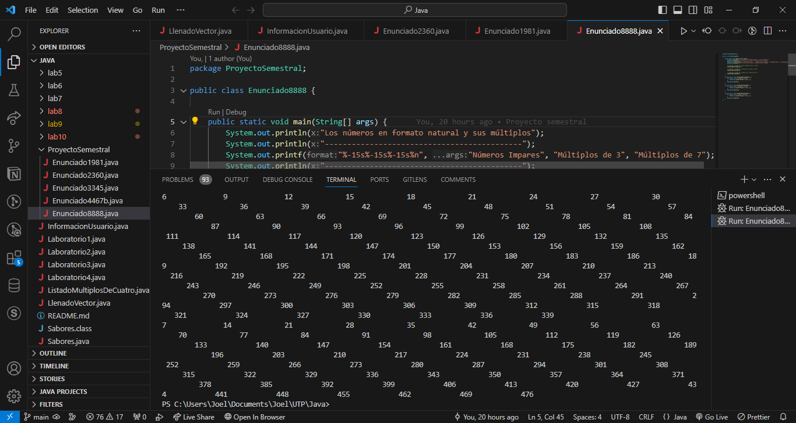

# ☕ Repositorio Java — UTP


Tareas, ejercicios y proyectos desarrollados en **Java** como parte de las
asignaturas de la **Universidad Tecnológica de Panamá (UTP)**.

El repositorio está dividido por asignatura:

| Curso | Carpeta | Enfoque |
|-------|---------|---------|
| Desarrollo de Software 2 | [`DesarrolloDeSoftware2/`](DesarrolloDeSoftware2) | Fundamentos de Java: sintaxis, estructuras de control, arrays, funciones y POO |
| Desarrollo de Software 3 | [`DesarrolloDeSoftware3/`](DesarrolloDeSoftware3) | Interfaces gráficas (Swing), eventos, archivos y bases de datos |

---

## 📘 Desarrollo de Software 2

Laboratorios organizados por tema, cada uno en su propia carpeta:

| Laboratorio | Tema |
|-------------|------|
| `lab1`  | Introducción y primer programa |
| `lab2`  | Salida de datos por pantalla |
| `lab3`  | Operadores aritméticos y variables |
| `lab4`  | Lectura de datos desde teclado |
| `lab5`  | Sentencias condicionales (`if` y `switch`) |
| `lab6`  | Bucles |
| `lab7`  | Números aleatorios |
| `lab8`  | Arrays unidimensionales y bidimensionales |
| `lab9`  | Funciones |
| `lab10` | Programación Orientada a Objetos (POO) |

Carpetas adicionales:

- **`ProyectoSemestral/`** — Proyecto integrador del semestre.
- **`Otros/`** — Ejercicios sueltos (información de usuario, vectores, etc.).

---

## 🖥️ Desarrollo de Software 3

Ejercicios centrados en **interfaces gráficas con Swing** y conceptos asociados:

- **Botones y eventos:** `CrearBotones`, `BotonesColores`, `MatrizBotones`, `Contador`, `Calculadora`
- **Gráficos:** `Graficos`, `Grafico1`, `Grafico_Boton`
- **Movimiento de componentes:** `Mover` → `Mover5`, `MoverVector`, `MoverVector2`
- **Menús:** `Menu`, `Menu2`, `Menu3`
- **Manejo de archivos:** `Archivo`, `Archivo2`, `Archivo3`
- **Bases de datos:** `Enlaces_Base_Datos`
- **Lógica y POO:** `Adivina`, `AdivinaComputadora`, `Aleatorio`, `Herencia`, `HolaMundo`

### Proyecto

- **`Proy1_Ratones/`** — Primer proyecto del curso ([enunciado en PDF](DesarrolloDeSoftware3/Proy1_DS3_Ratones_.pdf)).

---

## 🛠️ Tecnologías

- **Lenguaje:** Java 17
- **Editor:** Visual Studio Code (extensión *Extension Pack for Java*)
- **Interfaz gráfica:** Java Swing

---

## ▶️ Cómo ejecutar un ejercicio

```bash
# Compilar
javac NombreArchivo.java

# Ejecutar
java NombreArchivo
```

> Los archivos `.class` (compilados) no se versionan: se generan al compilar.

---

## 📸 Captura



---

## 👤 Autor

- **Joel Álvarez** — [@JoelAPL](https://github.com/JoelAPL)
